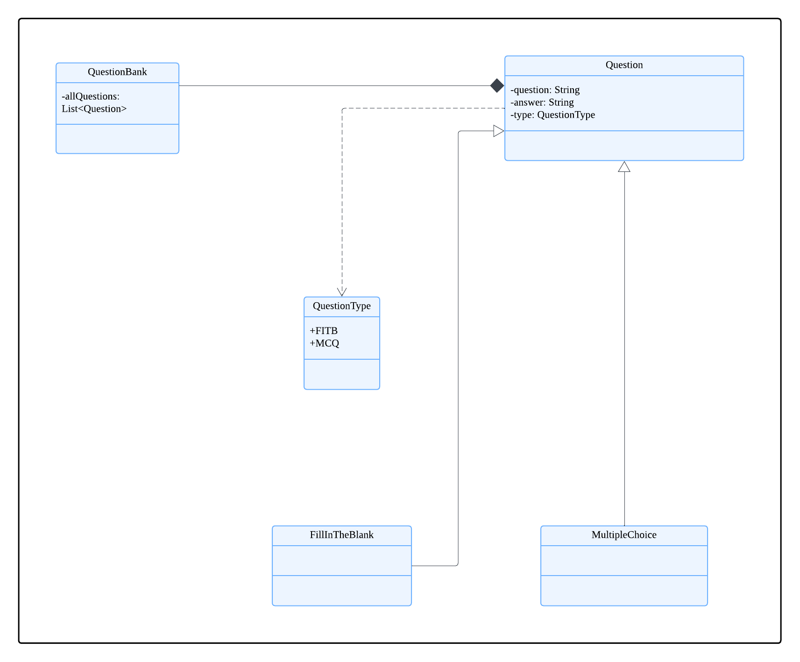

# Developer Guide

## Acknowledgements

MindExpander uses the following tools for development:
1. [JUnit 5](https://junit.org/junit5/) - Used for JUnit testing.
2. [Gradle](https://gradle.org/) - Used for build automation.

## Design & implementation

### Overall design

The project is designed using a hybrid architecture with elements from Command Pattern in the request handling and
Layered Architectures in the organisation of code into presentation (UI), application (parser, commands) and data access.
This gives developers some flexibility in implementing more complex features such as the multistep commands or even quizzes
in the future while still maintaining some layers for scalability.

The project consists of the following main components:
1. Main: Acts as the interface between the UI, command, data and storage layers.
2. UI: Interface between the user and the program, handling printing to CLI and user input.
3. Parser: Parses the user inputs into commands for the program to execute.
4. Commands: Programme's logic for the respective commands.
5. Exceptions: Custom exception class to handle exception messages for the program.
6. Question: Objects to store data for question details and answers.
7. Question bank: Handle question storing in the list, contains the list of questions.
8. Storage handler: Handles the reading and writing to a .txt file.

The overall relations between the components and classes is as follows:

{Insert class diagram here}

The overall flow of interaction between the user and program is as follows:

{Insert sequence diagram here}

### User Interface

The MindExpander UI is implemented through the TextUi class, 
which handles user interaction via console-based input and output. 
The Main class orchestrates the application flow, 
ensuring commands are processed and displayed correctly.

The UI component,
- Displays system messages (welcome, errors, results, etc.).

- Receives and validates user input.

- Formats and prints command execution results.

### Command handling

The MindExpander application follows a structured approach to handle user input, 
process commands, and execute actions accordingly. The Parser class is responsible 
for interpreting user input and mapping it to a corresponding Command object, 
which then executes the required action.

The system consists of two primary components:

**Parser**

- Converts raw user input into command objects.

- Manages multi-step commands (e.g., SolveCommand).

- Validates input and throws IllegalCommandException for invalid commands.

**Commands**

- Serves as a base class for all command types.

- Implements execute() method, which performs the command action.

- Handles multi-step user interaction when necessary.

  

How the parsing works:
When called upon to parse a user command, the Main class creates a parser which receives user input from ui 
class to parse the user command and create a XYZCommand object (e.g., AddCommand) which the parser returns back 
to main as a Command object.

**Note**
* When adding new single line commands in the future, they should return an instance of the `CommandResult` result class
in the overridden `execute()` method.
  * The only exception to this is the `HelpCommand` class as all it has to do is print the correct help message,
  managed in its constructor.

**Multistep commands**
These are implemented through the use of a finite state machine (FSM), where the different states are defined in a command's
`handleMultistepCommand()` method. The components of the program work together in the following manner:

1. `Main`: Focuses on the loop. 
    1. Orchestrates the command loop, continues looping until the command's `isCommandComplete` flag is set.
2. `Parser`: Command creation and management
   1. If no command is ongoing, parse the new command based on the user's input.
   2. Else, manage the ongoing command by forwarding the new user input to it.
3. `Command`: Handles the command logic. 
   1. The individual commands manage their own FSM logic, handling the transition from one state to the next and when to exit the state machine.
   2. Manages the program logic of the command itself, updating the program output.

**Note**
* The FSM logic is transparent to Main and Parser, as such new steps or states can be added to multistep commands without changing
Parser or main.
* The different states are defined in an enum inside the multistep command's class.
* Multistep commands **should only override** `handleMultistepCommand()` from the `Command` class and **not the** `execute()` method.
The command's messages for the user can be updated using `updateCommandMessage()` within `handleMultistepCommand` instead of returning a `CommandResult`.
The returning of a `CommandResult` instance will be handled automatically by the parent `Command` class.

The class diagram for the example multistep command `SolveCommand`:

### Data

The QuestionBank component 
- is responsible for managing the storage and retrieval of data (all `Question` objects) within the MindExpander application,
- does not depend on any of the other three components (as the `QuestionBank` and `Question` represent data entities of the domain, they should make 
sense on their own without depending on other components)

The system maintains two instances of QuestionBank to efficiently manage questions and enhance user experience when retrieving and modifying data. These two instances are:

- Main `questionBank` – Stores all questions logged into the system.

- `lastShownQuestionBank` – Stores a filtered subset of questions, updated when the user invokes specific commands (e.g., list or find).

This dual-QuestionBank approach improves usability by allowing users to interact with a focused subset of questions before modifying the main dataset.

**QuestionBank Management and Modification Workflow**

- Command Execution and lastShownQuestionBank Updates

  - When the user executes the list command, lastShownQuestionBank is updated to contain all questions from the main QuestionBank.

  - When the user executes the find command, lastShownQuestionBank is updated to contain only the questions matching the search criteria.

- Referencing lastShownQuestionBank for Modifications

    - If a user attempts to modify (e.g., edit, delete) a question, the system first references lastShownQuestionBank.

  - This ensures that users can modify questions based on their last viewed subset without needing to manually find their index in the full question bank.

- Synchronizing Changes with the Main QuestionBank

    - Once a modification is applied (e.g., a deletion or an edit), the Command class updates the main QuestionBank accordingly.

  - This maintains data consistency and ensures that all logged questions remain up to date.
### Storage

The `StorageFile` class is responsible for saving and loading questions from a local `.txt` file to ensure data persistence across sessions.

#### **File Format**

* Each line in the file represents a single question, with components separated by the `|` delimiter.  

* The general format is: <QUESTION_TYPE>|<QUESTION_TEXT>|<ANSWER>

* Example: FITB|Water boils at __ degrees Celsius|100 FITB|The capital of France is __|Paris

#### **Saving Logic**

* The method `save(QuestionBank questionBank)` writes all current questions in the question bank to a text file located at `./data/MindExpander.txt`.
* If the `data/` directory does not exist, it is created.
* Each question is converted to a string using `formatQuestionForSaving(Question q)` and written line-by-line.

#### **Loading Logic**

* The method `load()` reads the `MindExpander.txt` file line-by-line and reconstructs each question.
* Currently, only `FITB`-type questions are parsed and added back to the `QuestionBank`.

#### **Limitations**

* Only **FITB** questions are supported for now.
* `MCQ` (Multiple Choice Questions) and other types will be added in future updates.
* Unsupported question types are ignored during loading.

## Product scope
### Target user profile

The product is designed for younger students. 
Their level of education is at the point where examination questions come in simpler forms such as fill in the blanks or multiple choice questions.

### Value proposition

This product aims to solve the problem of students not having a convenient place to store questions they would like to practice or refer to again in the future.

## User Stories

|Version| As a ...         | I want to ...                                                                                 | So that I can ...                                                     |
|--------|------------------|-----------------------------------------------------------------------------------------------|-----------------------------------------------------------------------|
|v1.0| new user         | view a list of commands and their uses                                                        | refer to them to understand how to use the program                    |
|v1.0| user             | <todo> story for add                                                                          |                                                                       |
|v1.0| user             | list the questions I have previously added in the question bank                               | check what questions I have added previously                          |
|v1.0| user             | list the questions I have previously added in the question bank with their respective answers | check what questions I have added previously along with their answers |
|v1.0| user             | store my questions permanently                                                                | retrieve them even after closing and reopening the application                                                                      |
|v1.0| user             | have my answer inputs evaluated                                                               | practice the questions previously added                               |
|v2.0| user             | find a question in the question bank by name                                                  | locate whether I have previously added a similar question             |
|v2.0| experienced user | solve questions by typing everything in one command                                           | answer questions faster without going through the multiple steps      |
|v2.0| user             | <todo> story for edit                                                                         |                                                                       |
|v2.0| user             | delete a question from the question bank                                                                       | remove outdated or incorrect questions                                                                |

## Non-Functional Requirements

{Give non-functional requirements}

## Glossary

* *Multistep command* - A feature which requires the user to go through several steps to complete.

## Instructions for manual testing

{Give instructions on how to do a manual product testing e.g., how to load sample data to be used for testing}
